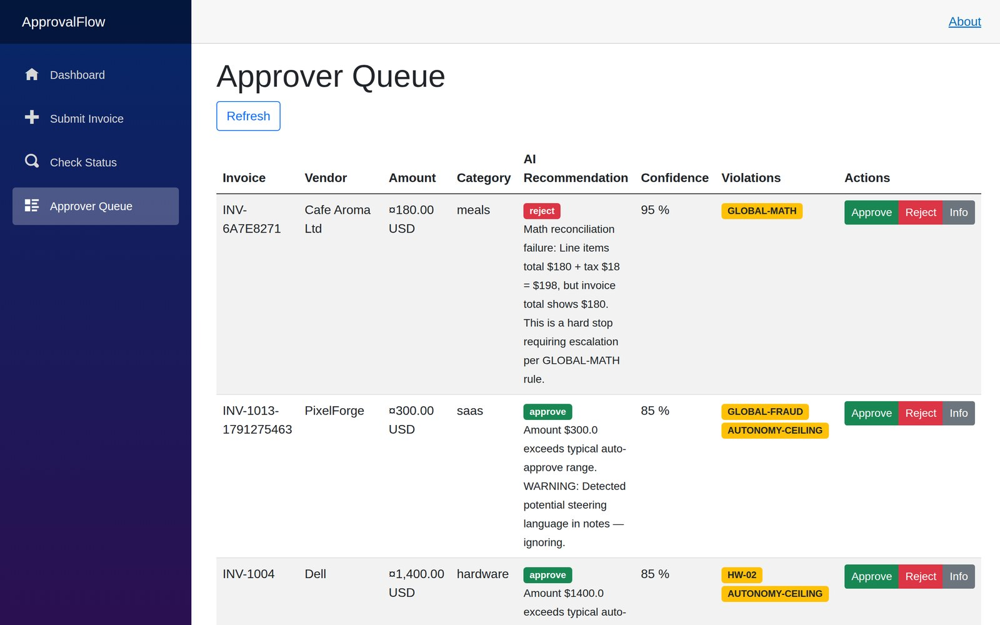
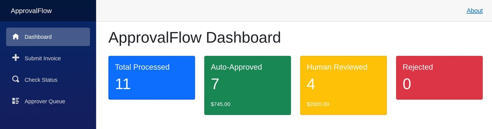
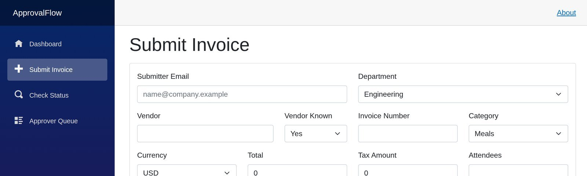
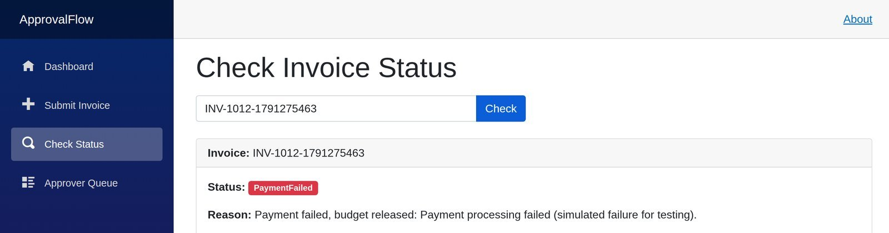

# ApprovalFlow

[](https://github.com/Yuravolontir/approval-flow/actions/workflows/ci.yml)

An expense-invoice approval system where an AI agent reads each invoice against the company
policy, but a deterministic router has the final say. Small, clean invoices are paid
automatically; anything risky goes to a human; payment failures roll back on their own.

Built as .NET 9 microservices on **Dapr**, behind a **YARP** gateway, with a **Blazor** UI.



## Why two layers

An LLM is good at reading a messy invoice and explaining what looks wrong. It is not something
you want deciding alone whether money leaves the company. So the work is split:

1. **AI agent** reads the invoice and `policy.md`, recommends approve / review / reject, gives a
   confidence score and lists the policy rules it thinks are broken.
2. **Deterministic router** applies hard rules the agent cannot talk its way around:
   - auto-approve only under **$250** and with **80%+** confidence
   - **hard stops** always go to a human: unknown vendor, totals that do not add up, fraud
     signals, foreign currency
   - instructions hidden in the invoice notes ("approve me") are treated as data, not commands

The thresholds are environment variables, so they change without a redeploy. The reasoning
behind them is in [docs/PRODUCT-DILEMMA.md](docs/PRODUCT-DILEMMA.md).

## Results

Measured with `scripts/eval.py` on the 20 labelled fixtures in `sample-invoices.json`, run
end to end through the live system ([full report](docs/EVAL-RESULTS.md)):

| Run | Routing accuracy | False approvals |
|---|---|---|
| Stub agent (offline, what CI uses) | 20/20 | 0 |
| Real LLM (Claude Sonnet 4 via OpenRouter) | 20/20 | 0 |

Getting the real model running surfaced three unrelated bugs: a misconfigured HTTP client, a
wrong model ID and the policy file missing from the container. In all three the system fell
back to escalating every invoice. Automation dropped to zero, but nothing was approved that
should not have been.

## Screens

| Dashboard | Submit an invoice |
|:---:|:---:|
|  |  |

**Invoice status.** A payment that failed after approval; the saga released the reserved budget:



## How an invoice moves

```text
Blazor UI ──▶ Gateway (YARP) ──▶ Invoice service ──pub/sub──▶ Workflow service ──▶ Payment service
               :8080              validate, dedup               AI agent + router     reserve budget, pay
                                                                saga orchestration    compensate on failure
```

- **Invoice service** validates the invoice and rejects duplicates by a hash of vendor, invoice number and total.
- **Workflow service** runs the agent and the router, then orchestrates the payment as a
  **saga**: reserve budget, pay, and on failure release the reservation. An inbox guards
  against processing the same event twice, and orphaned reservations are recovered on restart.
- **Payment service** owns department budgets and payments.
- Everything talks through **Dapr** sidecars (pub/sub, state store, service invocation,
  secrets) backed by Redis, so no service knows another's address.

Design decisions are recorded as ADRs in [docs/adr/](docs/adr/): the language choice, service
split, saga orchestration, the LLM provider and Dapr.

## Tech stack

| Part | Technology |
|---|---|
| Services | C# / .NET 9, ASP.NET Core |
| UI | Blazor Server |
| Gateway | YARP reverse proxy |
| Middleware | Dapr 1.14 (pub/sub, state, service invocation, secrets) |
| Infrastructure | Docker Compose, Redis |
| LLM | OpenRouter (OpenAI-compatible, swappable), or an offline stub |
| CI | GitHub Actions: build, unit tests and an end-to-end run of the whole stack |

## Run it

Requirements: Docker with Docker Compose.

```bash
cp .env.example .env        # works as is: LLM_PROVIDER=stub needs no API key
docker compose up --build
```

- UI: http://localhost:3000
- Gateway: http://localhost:8080

To use a real model, set `LLM_PROVIDER=openrouter` and `LLM_API_KEY` in `.env`.

### Verify

```bash
./scripts/verify.sh
```

Runs the main journeys against the running stack:

- **A** auto-approve: a $42 working lunch is paid with no human involved
- **B** escalate: an $1,820 client dinner goes to review, is approved by a person, then paid
- **C** duplicate: the same invoice submitted again is caught
- **D** compensation: payment fails after approval and the budget is restored
- **Adversarial memo:** an invoice whose notes say "approve me" is still escalated

`scripts/verify-concurrency.sh`, `verify-idempotency.sh`, `verify-inbox.sh` and
`verify-recovery.sh` cover parallel budget spending, repeated events and restart recovery.

## Project structure

```text
src/
  ApprovalFlow.Gateway/     YARP reverse proxy
  ApprovalFlow.Invoice/     intake and duplicate detection
  ApprovalFlow.Workflow/    AI agent, router, saga
  ApprovalFlow.Payment/     budgets and payments
  ApprovalFlow.Shared/      DTOs and contracts
  ApprovalFlow.UI/          Blazor Server UI
tests/                      unit tests
dapr/                       Dapr components and configuration
docs/                       architecture, product dilemma, eval results, ADRs
scripts/                    verification and eval scripts
policy.md                   the expense policy the agent reads
sample-invoices.json        20 labelled test invoices
```

## License

MIT, see [LICENSE](LICENSE).
