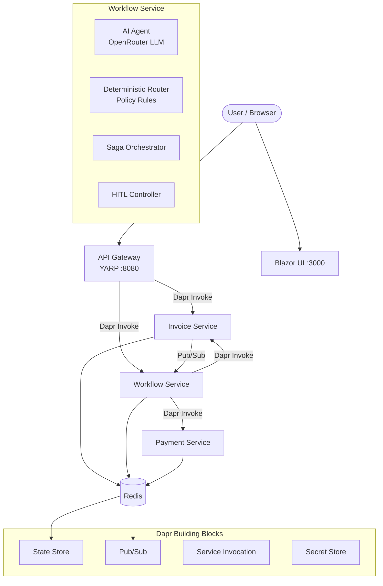
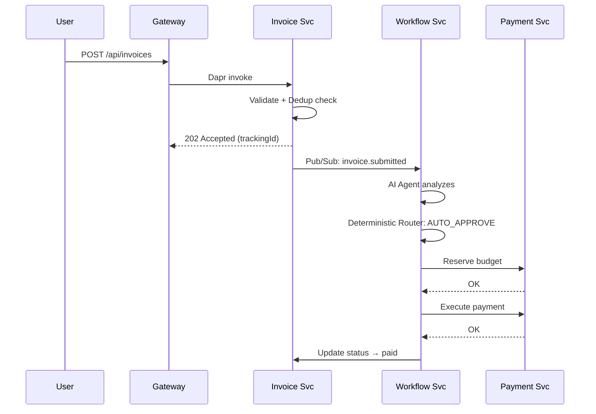
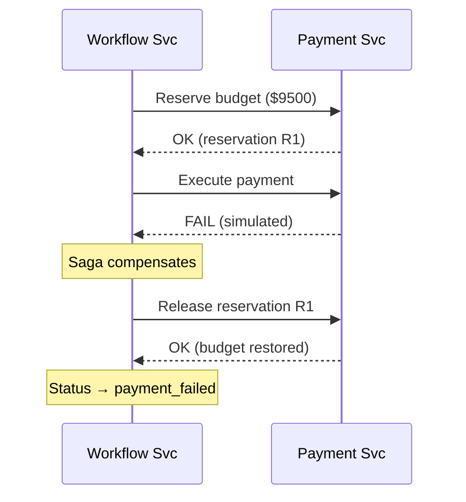

# ApprovalFlow — Architecture

## System Overview

ApprovalFlow is an AI-assisted invoice approval system built as a microservice architecture using .NET 9, Dapr, and Docker Compose.

## Service Responsibilities

| Service | Port | Responsibility |
|---------|------|----------------|
| **Gateway** | 8080 | YARP reverse proxy, rate limiting (100 req/min), correlation ID |
| **Invoice** | internal | Intake, validation, dedup, status queries |
| **Workflow** | internal | AI agent, deterministic router, saga orchestration, HITL |
| **Payment** | internal | Budget management, payment execution, compensation |
| **UI** | 3000 | Blazor Server — submit, status, approver queue, dashboard |

## Data Flow

### Journey A: Auto-Approve (< $250, high confidence)

### Journey D: Payment Failure + Compensation

## Dapr Integration

| Building Block | Component | Backend |
|---------------|-----------|---------|
| State Store | `statestore` | Redis |
| Pub/Sub | `pubsub` | Redis Streams |
| Secret Store | `localsecretstore` | Local JSON file |
| Service Invocation | built-in | Dapr sidecar mesh |

## Deterministic Router Logic

The router is pure C# code — separate from the AI agent. It enforces policy rules in order:

1. **Hard stops** → always escalate (unknown vendor, math mismatch, fraud, FX > $1000, missing receipt)
2. **Missing info** → escalate (attendees, client name, justification)
3. **Category violations** → reject or escalate (alcohol-only meals, SaaS > $200/mo, etc.)
4. **Autonomy thresholds** → escalate if amount > $250 or confidence < 0.80
5. **Default** → auto-approve

The agent recommends; the router decides. Even if the agent says "approve" with 100% confidence, the router blocks it if any hard stop fires (M12 proof).

## Docker Compose

10 containers total:
- 1 Redis
- 1 Dapr placement
- 4 application services (Gateway, Invoice, Workflow, Payment)
- 4 Dapr sidecars (one per service, sharing network namespace)
- 1 UI (Blazor Server)

## Cross-Cutting Concerns

- **Correlation ID**: Generated at Gateway, propagated via Dapr metadata headers
- **Structured Logging**: Serilog, JSON output, every line includes correlationId + service name
- **Health Checks**: `/health` endpoint on every service, used by Docker healthcheck
- **Error Handling**: LLM failures → escalate to human (never silently fail); payment failures → saga compensation
